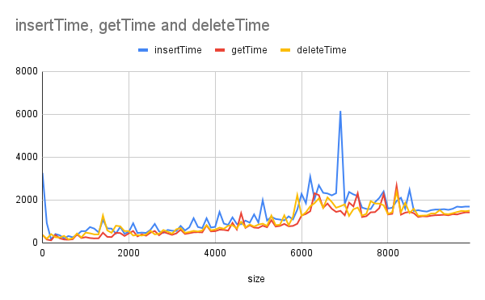
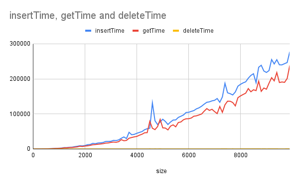
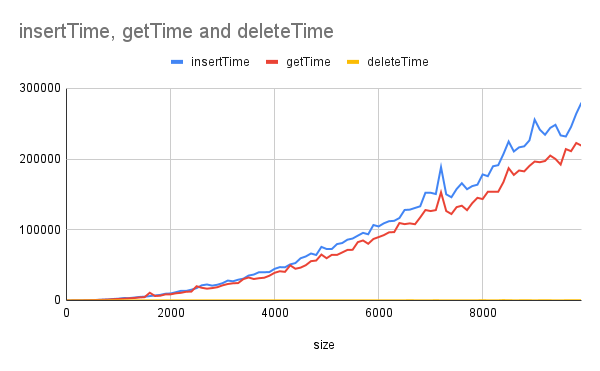

# projector-profiling

- Implements balanced BST tree and compares complexity for insert, get, delete elements

# BST

### [Implementation](./BST.java)
### [Test cases](./Application.java)

## Results

### Generate 100 datasets with random elements

[File with results](docs/random.csv)

### Generate 100 datasets with sorted (ASC) elements

[File with results](docs/sortedAsc.csv)

### Generate 100 datasets with sorted (DESC) elements

[File with results](docs/sortedDesc.csv)

