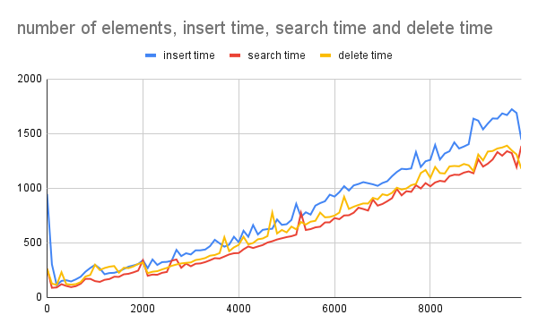
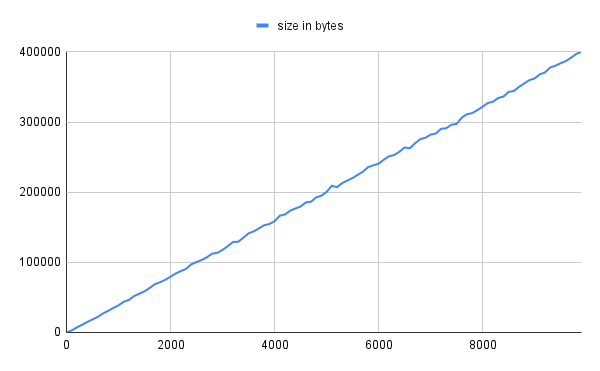
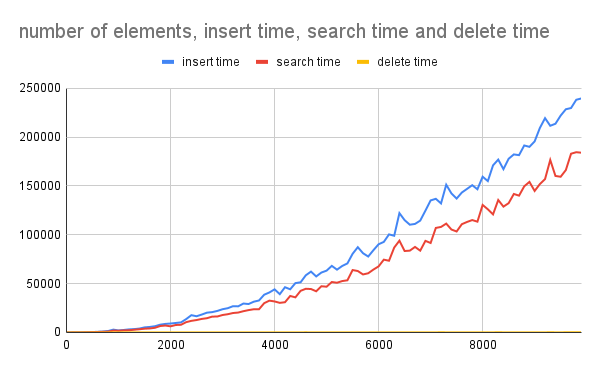
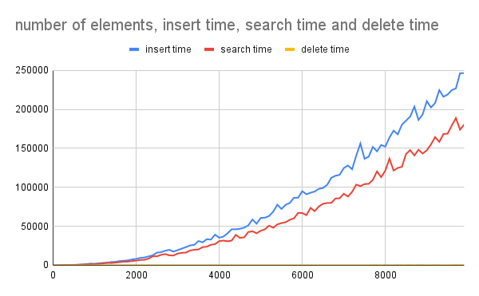

# projector-profiling

Implements balanced BST tree and compares:
1. complexity for insert, get, delete elements
2. How space size in bytes depends on number of elements

### [Implementation](app/src/main/java/com/jdum/projector/profiling/BST.java)
### [Test cases](app/src/main/java/com/jdum/projector/profiling/Application.java)

## Results

### Generate 100 datasets with random elements

[File with results](docs/random.csv)

#### Execution time

#### Size

### Generate 100 datasets with sorted (ASC) elements

[File with results](docs/sortedAsc.csv)

#### Execution time

#### Size

### Generate 100 datasets with sorted (DESC) elements

[File with results](docs/sortedDesc.csv)

#### Execution time

#### Size

